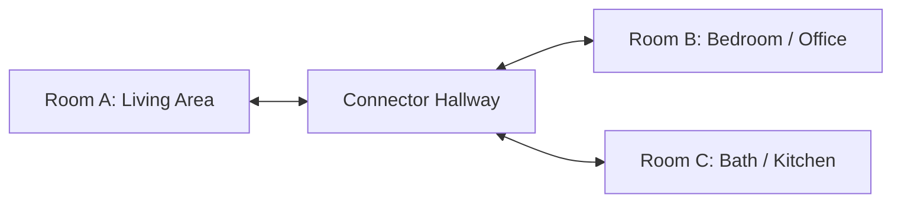

# Physical Ground-Truth Capture Checklist

Practical, field-ready protocol for capturing independent physical ground truth and sensor data across a multi-room environment (minimum 3 rooms + connector hallway).

---

## 1. Equipment Checklist

- [ ] **Laser Distance Meter**: Class II Laser Measurer (e.g. Leica DISTO D2 / Bosch GLM 50 C, ±1.5 mm accuracy)
- [ ] **Steel Tape Measure**: Certified Class II 8m tape for checking openings and short jambs
- [ ] **Capture Device**: iOS LiDAR device (iPhone Pro 12+ / iPad Pro) with Cozmo App or ARKit sensor logger
- [ ] **Measurement Sheet**: `benchmark/ground_truth/PHYSICAL_MEASUREMENTS.csv` (printout or tablet spreadsheet)

---

## 2. Capture Plan

### Required Room Capture Set

| Zone | Capture Tier | Scans Required | Physical GT Collected |
|---|---|---|---|
| **Room A** (Living) | **LiDAR** (Dual) | Scan 1 (Sweep A) Scan 2 (Sweep B, independent) | Wall lengths (w1..wN), ceiling height, door/window widths |
| | **Video** | 1 Monocular 60fps continuous sweep | |
| | **Photo** | 1 Set (4–8 wide-angle overlapping stills) | |
| **Room B** (Bedroom/Office) | **LiDAR** | 1 LiDAR sweep | Wall lengths, ceiling height, door/window widths |
| | **Video** | 1 Monocular 60fps sweep | |
| | **Photo** | 1 Set (4–8 stills) | |
| **Room C / Hallway** (Connector) | **LiDAR & Video** | Multi-room continuous trajectory linking A, B, C | Passage openings, connector wall lengths, door jambs |

---

## 3. Physical Measurement Procedure (Human Surveyor)

1. **Clear Floor Spans**: Measure each wall corner-to-corner at 1.0 m height above finished floor. Record in meters (`value_m`).
2. **Ceiling Height**: Take at least 2 vertical disto shots per room at center and corner. Record as `ceiling_height`.
3. **Door Openings**: Measure clear jamb-to-jamb opening width. Record as `door_width`.
4. **Window Openings**: Measure clear reveal-to-reveal opening width. Record as `window_width`.
5. **Record in Sheet**: Enter all rows into `benchmark/ground_truth/PHYSICAL_MEASUREMENTS.csv`:
   - Columns: `property_id,room_id,measurement_id,measurement_type,value_m,device,method,notes`

---

## 4. Digital Sensor Capture Rules

1. **LiDAR Scans**:
   - Maintain 0.5–3.0m distance from surfaces; sweep walls from floor to ceiling smoothly.
   - For Room A Repeatability: Ensure Scan 1 and Scan 2 are **genuinely separate physical recordings** (reset AR session between sweeps).
2. **Video Scans**:
   - Walk at slow, steady pace (~0.3 m/s) with minimal motion blur.
   - Loop back to starting location for multi-room sequences to provide loop-closure anchor frames.
3. **Photo Stills**:
   - Capture 4 to 8 high-resolution photos with 60%+ overlap from perimeter corners and center facing walls.
   - Avoid extreme illumination gradients or pure featureless white walls without texture.

---

## 5. Ingestion into Benchmark Suite

Once data is gathered:
1. Save physical measurements to `benchmark/ground_truth/measurements.csv` and `openings.csv`.
2. Place raw captures in `data/raw/` or `sample data/`.
3. Run `python3 scripts/run_final_benchmark.py --gt-dir benchmark/ground_truth`.
